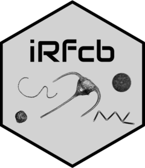

# I 'R' FlowCytobot (iRfcb): Tools for Managing Imaging FlowCytobot (IFCB) Data <a href="https://europeanifcbgroup.github.io/iRfcb/"></a>

[](https://github.com/EuropeanIFCBGroup/iRfcb/actions/workflows/r-cmd-check.yml)
[](https://CRAN.R-project.org/package=iRfcb)
[](https://app.codecov.io/gh/EuropeanIFCBGroup/iRfcb?branch=main)

## Overview

The `iRfcb` R package offers a suite of tools for managing and performing quality control on plankton data generated by the [Imaging FlowCytobot (IFCB)](https://mclanelabs.com/imaging-flowcytobot/). It streamlines the processing and analysis of IFCB data, facilitating the preparation of IFCB data and images for publication (e.g. in [GBIF](https://www.gbif.org/ipt), [OBIS](https://obis.org/), [EMODNet](https://emodnet.ec.europa.eu/en), [SHARK](https://shark.smhi.se/) or [EcoTaxa](https://ecotaxa.obs-vlfr.fr)). It is especially useful for researchers using, or partly using, the MATLAB [ifcb-analysis](https://github.com/hsosik/ifcb-analysis) package.

### Functional Highlights

- **Data Management**: Functions for reading raw and processed IFCB files, counting and summarizing annotated or classified image data, and accessing, correcting, and merging manually annotated datasets.
- **Quality Control**: Tools for geospatial quality control of IFCB data and analysis of [Particle Size Distribution](https://github.com/kudelalab/PSD).
- **Image Extraction**: Tools to extract and prepare images for publication.
- **Taxonomical Data**: Tools for handling and analyzing taxonomic data and calculating biomass concentration from image data.

## Installation

You can install `iRfcb` from CRAN using:

```r
install.packages("iRfcb")
```

### Development version

To access a feature from the development version of `iRfcb`, install the latest development version from GitHub using the `remotes` package:

```r
# install.packages("remotes")
remotes::install_github("EuropeanIFCBGroup/iRfcb")
```

## Documentation and Tutorials

### Reference

For a detailed overview of all available `iRfcb` functions, please visit the reference section:

- [Function Reference](https://europeanifcbgroup.github.io/iRfcb/reference/index.html)

### Tutorials

Explore the key features and capabilities of `iRfcb` through the tutorials:

- [iRfcb Introduction](https://europeanifcbgroup.github.io/iRfcb/articles/a-general-tutorial.html)
- [Quality Control of IFCB Data](https://europeanifcbgroup.github.io/iRfcb/articles/qc-tutorial.html)
- [Handling MATLAB Results](https://europeanifcbgroup.github.io/iRfcb/articles/matlab-tutorial.html)
- [Creating a DwC-A from IFCB Data](https://europeanifcbgroup.github.io/iRfcb/articles/dwca-tutorial.html)
- [Sharing Annotated IFCB Images](https://europeanifcbgroup.github.io/iRfcb/articles/image-export-tutorial.html)
- [Prepare IFCB Images for EcoTaxa](https://europeanifcbgroup.github.io/iRfcb/articles/ecotaxa-tutorial.html)
- [WHOI-Plankton Data Integration](https://europeanifcbgroup.github.io/iRfcb/articles/whoi-plankton-data-integration.html)

### Example Usage

`iRfcb` is designed for integration into IFCB data processing pipelines. For an example, see its implementation in the following project:

- [Example Data Pipelines](https://github.com/nodc-sweden/ifcb-data-pipeline)


## Python Dependency

Some functions in `iRfcb` require Python, and you will be notified when you call one of these functions. You can download Python from the official website: [python.org/downloads](https://www.python.org/downloads/). For details on what function that require Python, please visit the project's [Function Reference](https://europeanifcbgroup.github.io/iRfcb/reference/index.html#python-dependency-python-powered-python-powered-w-x-png-).

A Python virtual environment (venv) can be created using the `ifcb_py_install()` function before calling the function that require Python. 

The `iRfcb` package can also be configured to automatically activate an installed Python venv upon loading by setting an environment variable. This feature is especially useful for users who regularly interact with Python dependencies within the `iRfcb` package.

### USE_IRFCB_PYTHON

- **Description**: The `USE_IRFCB_PYTHON` environment variable controls whether the package automatically activates a pre-installed Python venv named `iRfcb` when the package is loaded.
- **Default**: By default, this environment variable is not set. This means that the Python environment will not be loaded automatically, and the user must call the `ifcb_py_install()` functions manually before using a Python feature.
- **Usage**: To enable automatic setup of the Python environment when `iRfcb` is loaded, set `USE_IRFCB_PYTHON` to `"TRUE"`. Ensure that a venv named `iRfcb` is installed (e.g. through `ifcb_py_install()`) in `reticulate::virtualenv_root()` and available via `reticulate::virtualenv_list()`.

#### How to Set the `USE_IRFCB_PYTHON` Variable

You can set the `USE_IRFCB_PYTHON` variable in your R session or make it persistent across sessions:

1. **Temporary for the session**: 
   You can set the variable in your R session before loading `iRfcb` using the following command:
   ```r
   Sys.setenv(USE_IRFCB_PYTHON = "TRUE")
   ```

2. **Permanent across sessions**:
   To ensure this setting persists across R sessions, add it to your `.Renviron` file in your R home directory. You can easily edit the file using the following command:
   ```r
   usethis::edit_r_environ("user")
   ```
   
   Then, add the following line to the file:
   ```text
   USE_IRFCB_PYTHON=TRUE
   ```
   This will automatically set the environment variable each time you start an R session.

## Getting help

If you encounter a bug or need an IFCB feature that’s missing, please report it on [GitHub](https://github.com/EuropeanIFCBGroup/iRfcb/issues) with a minimal reproducible example.

## Repository

For more details and the latest updates, visit the [GitHub repository](https://github.com/EuropeanIFCBGroup/iRfcb).

## License

This package is licensed under the MIT License.
