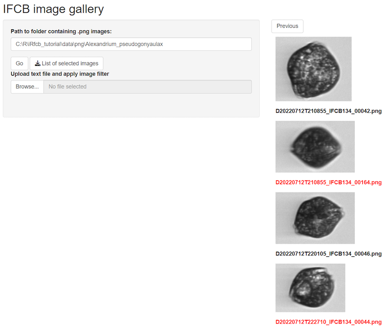

# Handling MATLAB Results

## Introduction

This vignette demonstrates how to process and refine annotated and
automatically classified Imaging FlowCytobot (IFCB) data in R using the
`iRfcb` package. The workflow assumes that MATLAB-based preprocessing
has already been conducted using the
[`ifcb-analysis`](https://github.com/hsosik/ifcb-analysis) repository
(Sosik and Olson 2007). This preprocessing includes generating `.mat`
files for annotated and classified images.

With `iRfcb`, you can further analyze and manage IFCB data, including
summarizing annotations and class results, refining annotations.

## Getting Started

### Installation

You can install the package from CRAN using:

``` r
install.packages("iRfcb")
```

Some functions from the `iRfcb` package used in this tutorial require
`Python` to be installed. You can download `Python` from the official
website: [python.org/downloads](https://www.python.org/downloads/).

The `iRfcb` package can be configured to automatically activate an
installed Python virtual environment (venv) upon loading by setting an
environment variable. For more details, please refer to the package
[README](https://europeanifcbgroup.github.io/iRfcb/).

Load the `iRfcb` library:

``` r
library(iRfcb)
```

### Download Sample Data

To get started, download sample data from the [SMHI IFCB Plankton Image
Reference Library](https://doi.org/10.17044/scilifelab.25883455.v3)
(Torstensson et al. 2024) with the following function:

``` r
# Define data directory
data_dir <- "data"

# Download and extract test data in the data folder
ifcb_download_test_data(
  dest_dir = data_dir,
  verbose = FALSE
)
```

## Classified Results from MATLAB

The `iRfcb` package facilitates the processing and analysis of data
classified using a random forest algorithm from the
[`ifcb-analysis`](https://github.com/hsosik/ifcb-analysis) repository.
This workflow supports various tasks such as extracting classified
results, reading summary files, and calculating biovolume and carbon
content.

This section provides an overview of key functions available in `iRfcb`
for handling classified IFCB data. Step-by-step examples are included to
guide users through extracting results, summarizing data, and leveraging
functionalities for both automated and manually annotated datasets.

### Extract Classified Images from a Sample

To begin working with classified data, you can extract all classified
images from a specific sample. This is especially useful for isolating
ROIs based on specific taxa or classification thresholds.

``` r
# Extract all classified images from a sample
ifcb_extract_classified_images(
  sample = "D20230314T001205_IFCB134",
  classified_folder = "data/classified",
  roi_folder = "data/data",
  out_folder = "data/classified_images",
  taxa = "Tripos_lineatus", # A specific taxa or "All"
  threshold = "opt" # or specify another threshold
) 
```

    ## Writing 1 ROIs from D20230314T001205_IFCB134.roi to data/classified_images/Tripos_lineatus

### Read a Summary File

Summary files generated by the MATLAB function
`countcells_allTBnew_user_training` provide aggregated classified data.
Use the following function to read and process these files.

``` r
# Read a MATLAB summary file generated by `countcells_allTBnew_user_training`
summary_data <- ifcb_read_summary(
  "data/classified/2023/summary/summary_allTB_2023.mat",
  biovolume = FALSE,
  threshold = "opt"
)

# Print output
head(summary_data)
```

    ## # A tibble: 6 × 12
    ##   sample   timestamp           date        year month   day time     ifcb_number
    ##   <chr>    <dttm>              <date>     <dbl> <dbl> <int> <time>   <chr>      
    ## 1 D202308… 2023-08-10 11:30:59 2023-08-10  2023     8    10 11:30:59 IFCB134    
    ## 2 D202308… 2023-08-10 11:30:59 2023-08-10  2023     8    10 11:30:59 IFCB134    
    ## 3 D202308… 2023-08-10 11:30:59 2023-08-10  2023     8    10 11:30:59 IFCB134    
    ## 4 D202308… 2023-08-10 11:30:59 2023-08-10  2023     8    10 11:30:59 IFCB134    
    ## 5 D202308… 2023-08-10 11:30:59 2023-08-10  2023     8    10 11:30:59 IFCB134    
    ## 6 D202308… 2023-08-10 11:30:59 2023-08-10  2023     8    10 11:30:59 IFCB134    
    ## # ℹ 4 more variables: ml_analyzed <dbl>, species <chr>, counts <dbl>,
    ## #   counts_per_liter <dbl>

Alternatively, `iRfcb` can directly aggregate data and compute carbon
content from classification files using the
[`ifcb_summarize_biovolumes()`](https://europeanifcbgroup.github.io/iRfcb/reference/ifcb_summarize_biovolumes.md)
function demonstrated below.

### Summarize Counts, Biovolumes and Carbon Content from Classified IFCB Data

This function calculates aggregated biovolumes and carbon content from
IFCB samples based on feature and MATLAB classification result files,
without summarizing the data in MATLAB. The function can also be adapted
to process classification results from other non-MATLAB machine learning
algorithms (e.g., a CNN model) by providing custom lists of image names
and class labels through the `custom_images` and `custom_classes`
arguments.

Biovolumes are converted to carbon according to Menden-Deuer and Lessard
(2000) for individual ROIs, where different conversion factors are
applied to diatoms and non-diatom protist. If provided, it also
incorporates sample volume data from `.hdr` files to compute biovolume
and carbon content per liter of sample. See details in the help pages
for
[`ifcb_summarize_biovolumes()`](https://europeanifcbgroup.github.io/iRfcb/reference/ifcb_summarize_biovolumes.md)
and
[`ifcb_extract_biovolumes()`](https://europeanifcbgroup.github.io/iRfcb/reference/ifcb_extract_biovolumes.md).

``` r
# Summarize biovolume data using IFCB data from classified data folder
biovolume_data <- ifcb_summarize_biovolumes(
  feature_folder = "data/features/2023",
  mat_files = "data/classified",
  hdr_folder = "data/data/2023",
  micron_factor = 1 / 3.4,
  diatom_class = "Bacillariophyceae",
  threshold = "opt",
  verbose = FALSE # Do not print progress bars
) 

# Print output
head(biovolume_data)
```

    ## # A tibble: 6 × 10
    ##   sample             classifier class counts biovolume_mm3 carbon_ug ml_analyzed
    ##   <chr>              <chr>      <chr>  <int>         <dbl>     <dbl>       <dbl>
    ## 1 D20230314T001205_… "Z:\\data… Chae…      1   0.00000255  0.000117         4.57
    ## 2 D20230314T001205_… "Z:\\data… Cili…     11   0.0000479   0.00601          4.57
    ## 3 D20230314T001205_… "Z:\\data… Cryp…    162   0.0000291   0.00455          4.57
    ## 4 D20230314T001205_… "Z:\\data… Cyli…      4   0.000000918 0.0000536        4.57
    ## 5 D20230314T001205_… "Z:\\data… Dino…      3   0.0000162   0.00207          4.57
    ## 6 D20230314T001205_… "Z:\\data… Dino…    137   0.0000722   0.0106           4.57
    ## # ℹ 3 more variables: counts_per_liter <dbl>, biovolume_mm3_per_liter <dbl>,
    ## #   carbon_ug_per_liter <dbl>

### Summarize Counts, Biovolumes and Carbon Content from Manually Annotated IFCB Data

The
[`ifcb_summarize_biovolumes()`](https://europeanifcbgroup.github.io/iRfcb/reference/ifcb_summarize_biovolumes.md)
function can also be used to calculate aggregated biovolumes and carbon
content from manually annotated IFCB image data. See details in the help
pages for
[`ifcb_summarize_biovolumes()`](https://europeanifcbgroup.github.io/iRfcb/reference/ifcb_summarize_biovolumes.md),
[`ifcb_extract_biovolumes()`](https://europeanifcbgroup.github.io/iRfcb/reference/ifcb_extract_biovolumes.md)
and
[`ifcb_count_mat_annotations()`](https://europeanifcbgroup.github.io/iRfcb/reference/ifcb_count_mat_annotations.md).

``` r
# Summarize biovolume data using IFCB data from manual data folder
manual_biovolume_data <- ifcb_summarize_biovolumes(
  feature_folder = "data/features",
  mat_files = "data/manual",
  class2use_file = "data/config/class2use.mat",
  hdr_folder = "data/data",
  micron_factor = 1 / 3.4,
  diatom_class = "Bacillariophyceae",
  verbose = FALSE # Do not print progress bars
)

# Print output
head(manual_biovolume_data)
```

    ## # A tibble: 6 × 10
    ##   sample             classifier class counts biovolume_mm3 carbon_ug ml_analyzed
    ##   <chr>              <lgl>      <chr>  <int>         <dbl>     <dbl>       <dbl>
    ## 1 D20220522T000439_… NA         Cili…      1    0.00000327  0.000432        4.86
    ## 2 D20220522T000439_… NA         Meso…      4    0.0000274   0.00344         4.86
    ## 3 D20220522T000439_… NA         Stro…      1    0.00000386  0.000504        4.86
    ## 4 D20220522T000439_… NA         uncl…      1    0.00000288  0.000384        4.86
    ## 5 D20220522T003051_… NA         Meso…      2    0.0000122   0.00155         2.98
    ## 6 D20220712T210855_… NA         Alex…      2    0.0000476   0.00555         4.91
    ## # ℹ 3 more variables: counts_per_liter <dbl>, biovolume_mm3_per_liter <dbl>,
    ## #   carbon_ug_per_liter <dbl>

## Manually Annotated Data from MATLAB

### Count and Summarize Annotated Image Data

#### PNG Directory

Summarize counts of annotated images at the sample and class levels. The
`hdr_folder` can be included to add GPS positions to the sample data
frame:

``` r
# Summarise counts on sample level
png_per_sample <- ifcb_summarize_png_counts(png_folder = "data/png",
                                            hdr_folder = "data/data",
                                            sum_level = "sample")

# Print output
head(png_per_sample)
```

    ## # A tibble: 6 × 13
    ## # Groups:   sample, ifcb_number [3]
    ##   sample    ifcb_number class_name n_images roi_numbers gpsLatitude gpsLongitude
    ##   <chr>     <chr>       <chr>         <int> <chr>             <dbl>        <dbl>
    ## 1 D2022052… IFCB134     Ciliophora        1 5                    NA           NA
    ## 2 D2022052… IFCB134     Mesodiniu…        4 2, 6, 7, 8           NA           NA
    ## 3 D2022052… IFCB134     Strombidi…        1 3                    NA           NA
    ## 4 D2022052… IFCB134     Mesodiniu…        2 2, 3                 NA           NA
    ## 5 D2022071… IFCB134     Alexandri…        2 42, 164              NA           NA
    ## 6 D2022071… IFCB134     Strombidi…        2 34, 79               NA           NA
    ## # ℹ 6 more variables: timestamp <dttm>, date <date>, year <dbl>, month <dbl>,
    ## #   day <int>, time <chr>

``` r
# Summarise counts on class level
png_per_class <- ifcb_summarize_png_counts(png_folder = "data/png",
                                           sum_level = "class")

# Print output
head(png_per_class)
```

    ## # A tibble: 6 × 2
    ##   class_name                  n_images
    ##   <chr>                          <int>
    ## 1 Alexandrium_pseudogonyaulax        3
    ## 2 Amphidnium-like                    1
    ## 3 Chaetoceros_spp_chain              6
    ## 4 Chaetoceros_spp_single_cell        3
    ## 5 Ciliophora                        23
    ## 6 Cryptomonadales                  245

#### MATLAB Files

Count the annotations in the MATLAB files, similar to
[`ifcb_summarize_png_counts()`](https://europeanifcbgroup.github.io/iRfcb/reference/ifcb_summarize_png_counts.md):

``` r
# Summarize counts from MATLAB files
mat_count <- ifcb_count_mat_annotations(
  manual_files = "data/manual",
  class2use_file = "data/config/class2use.mat",
  skip_class = "unclassified", # Or class ID
  sum_level = "class" # Or per "sample"
) 

# Print output
head(mat_count)
```

    ## # A tibble: 6 × 2
    ##   class                           n
    ##   <chr>                       <int>
    ## 1 Alexandrium_pseudogonyaulax     3
    ## 2 Amphidnium-like                 1
    ## 3 Chaetoceros_spp_chain           6
    ## 4 Chaetoceros_spp_single_cell     3
    ## 5 Ciliophora                     23
    ## 6 Cryptomonadales               245

### Run Image Gallery

To visually inspect and correct annotations, run the image gallery.

``` r
# Run Shiny app
ifcb_run_image_gallery()
```



image_gallery

Individual images can be selected and a list of selected images can be
downloaded as a `correction` file. This file can be used to correct
`.mat` annotations below using the
[`ifcb_correct_annotation()`](https://europeanifcbgroup.github.io/iRfcb/reference/ifcb_correct_annotation.md)
function.

### Correct .mat Files After Checking Images in the App

After reviewing images in the gallery, correct the `.mat` files using
the `correction` file with selected images:

``` r
# Get class2use
class_name <- ifcb_get_mat_names("data/config/class2use.mat")
class2use <- ifcb_get_mat_variable("data/config/class2use.mat", variable_name = class_name)

# Find the class id of unclassified
unclassified_id <- which(grepl("unclassified", class2use))

# Initialize the python session if not already set up
env_path <- "~/.virtualenvs/iRfcb" # Or your preferred venv path
ifcb_py_install(envname = env_path)

# Correct the annotation with the output from the image gallery
ifcb_correct_annotation(
  manual_folder = "data/manual",
  out_folder = "data/manual",
  correction = "data/manual/correction/Alexandrium_pseudogonyaulax_selected_images.txt",
  correct_classid = unclassified_id
)
```

### Replace Specific Class Annotations

Replace all instances of a specific class with **unclassified** (class
id 1):

``` r
# Get class2use
class_name <- ifcb_get_mat_names("data/config/class2use.mat")
class2use <- ifcb_get_mat_variable("data/config/class2use.mat", variable_name = class_name)

# Find the class id of Alexandrium_pseudogonyaulax
ap_id <- which(grepl("Alexandrium_pseudogonyaulax", class2use))

# Find the class id of unclassified
unclassified_id <- which(grepl("unclassified", class2use))

# Move all Alexandrium_pseudogonyaulax images to unclassified
ifcb_replace_mat_values(
  manual_folder = "data/manual",
  out_folder = "data/manual",
  target_id = ap_id,
  new_id = unclassified_id
)
```

### Verify Correction

Verify that the corrections have been applied:

``` r
# Summarize new counts after correction
mat_count <- ifcb_count_mat_annotations(
  manual_files = "data/manual",
  class2use_file = "data/config/class2use.mat",
  skip_class = "unclassified", # Or class ID
  sum_level = "class" # Or per "sample"
)

# Print output
head(mat_count)
```

    ## # A tibble: 6 × 2
    ##   class                                  n
    ##   <chr>                              <int>
    ## 1 Amphidnium-like                        1
    ## 2 Chaetoceros_spp_chain                  6
    ## 3 Chaetoceros_spp_single_cell            3
    ## 4 Ciliophora                            23
    ## 5 Cryptomonadales                      245
    ## 6 Cylindrotheca_Nitzschia_longissima    47

### Annotate Images from PNG Directories

Annotation data for IFCB images can be stored and modified in MATLAB
`.mat` files using functions such as
[`ifcb_annotate_samples()`](https://europeanifcbgroup.github.io/iRfcb/reference/ifcb_annotate_samples.md),
[`ifcb_annotate_batch()`](https://europeanifcbgroup.github.io/iRfcb/reference/ifcb_annotate_batch.md)
and
[`ifcb_adjust_classes()`](https://europeanifcbgroup.github.io/iRfcb/reference/ifcb_adjust_classes.md)
functions.

If your annotations are organized as PNG images in class-named
subdirectories, you can create manual `.mat` files directly from these
images using
[`ifcb_annotate_samples()`](https://europeanifcbgroup.github.io/iRfcb/reference/ifcb_annotate_samples.md).
This function automatically maps each PNG to its corresponding ROI in
the ADC file, assigns class IDs based on a `class2use.mat` file, and
writes a `.mat` file ready for use with the `ifcb-analysis` MATLAB
repository.

``` r
# Create manual MATLAB classification files from PNG images
ifcb_annotate_samples(png_folder = "data/png",
                      adc_folder = "data/data",
                      output_folder = "data/manual_from_pngs",
                      class2use_file = "data/config/class2use.mat")
```

This workflow simplifies converting image-based annotations into
MATLAB-compatible format, making them ready for analysis or further
adjustment.

### Annotate Images in Batch

If a manual file already exists for the sample, the ROI class list will
be updated accordingly using
[`ifcb_annotate_batch()`](https://europeanifcbgroup.github.io/iRfcb/reference/ifcb_annotate_batch.md).
If no file is found, a new `.mat` file will be created, with all
unannotated ROIs marked as unclassified.

``` r
# Read a file with selected images, generated by the image gallery app
correction <- read.table(
  "data/manual/correction/Alexandrium_pseudogonyaulax_selected_images.txt",
  header = TRUE
)

# Print image names to be annotated
print(correction$image_filename)
```

    ## [1] "D20220712T210855_IFCB134_00164.png" "D20220712T222710_IFCB134_00044.png"

``` r
# Re-annotate the images that were moved to unclassified earlier in the tutorial
ifcb_annotate_batch(
  png_images = correction$image_filename,
  class = "Alexandrium_pseudogonyaulax",
  manual_folder = "data/manual",
  adc_files = "data/data",
  class2use_file = "data/config/class2use.mat"
)

# Summarize new counts after re-annotation
mat_count <- ifcb_count_mat_annotations(
  manual_files = "data/manual",
  class2use_file = "data/config/class2use.mat",
  skip_class = "unclassified",
  sum_level = "class"
)

# Print output and check if Alexandrium pseudogonyaulax is back
head(mat_count)
```

    ## # A tibble: 6 × 2
    ##   class                           n
    ##   <chr>                       <int>
    ## 1 Alexandrium_pseudogonyaulax     2
    ## 2 Amphidnium-like                 1
    ## 3 Chaetoceros_spp_chain           6
    ## 4 Chaetoceros_spp_single_cell     3
    ## 5 Ciliophora                     23
    ## 6 Cryptomonadales               245

This concludes this tutorial for the `iRfcb` package. For more detailed
information, refer to the package documentation or the other
[tutorials](https://europeanifcbgroup.github.io/iRfcb/articles/). See
how data pipelines can be constructed using `iRfcb` in the following
[Example Project](https://github.com/nodc-sweden/ifcb-data-pipeline).
Happy analyzing!

## Citation

    ## To cite package 'iRfcb' in publications use:
    ## 
    ##   Anders Torstensson (2025). iRfcb: Tools for Managing Imaging
    ##   FlowCytobot (IFCB) Data. R package version 0.6.0.
    ##   https://CRAN.R-project.org/package=iRfcb
    ## 
    ## A BibTeX entry for LaTeX users is
    ## 
    ##   @Manual{,
    ##     title = {iRfcb: Tools for Managing Imaging FlowCytobot (IFCB) Data},
    ##     author = {Anders Torstensson},
    ##     year = {2025},
    ##     note = {R package version 0.6.0},
    ##     url = {https://CRAN.R-project.org/package=iRfcb},
    ##   }

## References

- Kraft, K., Velhonoja, O., Seppälä, J., Hällfors, H., Suikkanen, S.,
  Ylöstalo, P., Anglès, S., Kielosto, S., Kuosa, H., Lehtinen, S., Oja,
  J., Tamminen, T. (2022). SYKE-plankton_IFCB_2022 \[Data set\].
  <https://b2share.eudat.eu>.
  <https://doi.org/10.23728/b2share.abf913e5a6ad47e6baa273ae0ed6617a>
- Menden-Deuer Susanne, Lessard Evelyn J., (2000), Carbon to volume
  relationships for dinoflagellates, diatoms, and other protist
  plankton, Limnology and Oceanography, 3, doi:
  10.4319/lo.2000.45.3.0569.
- Sosik, H. M. and Olson, R. J. (2007) Automated taxonomic
  classification of phytoplankton sampled with imaging-in-flow
  cytometry. Limnol. Oceanogr: Methods 5, 204–216.
- Torstensson, A., Skjevik, A-T., Mohlin, M., Karlberg, M. and
  Karlson, B. (2024). SMHI IFCB Plankton Image Reference Library.
  SciLifeLab. Dataset. <https://doi.org/10.17044/scilifelab.25883455.v3>
