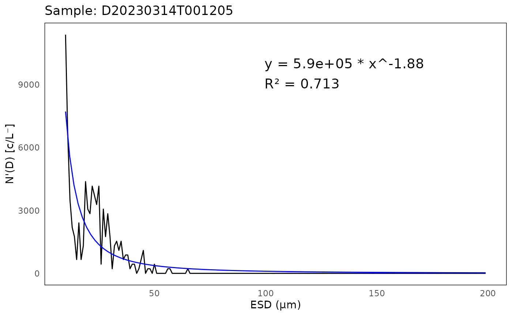
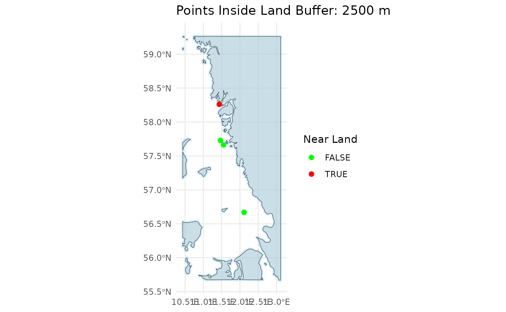
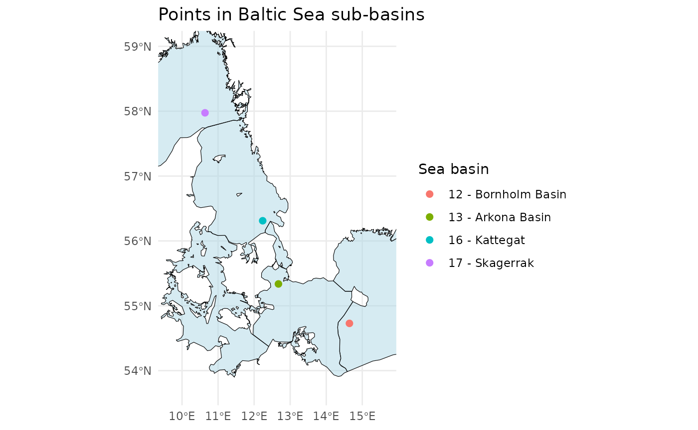

# Quality Control of IFCB Data

## Introduction

This vignette provides an overview of quality control (QC) methods for
Imaging FlowCytobot (IFCB) data using the `iRfcb` package. The package
offers tools to analyze Particle Size Distribution (PSD) following
Hayashi et al. (2025), verify geographical positions, and integrate
contextual data from sources like ferrybox systems. These QC workflows
ensure high-quality datasets for phytoplankton and microzooplankton
monitoring in marine ecosystems.

You’ll learn how to:

- Set up the `iRfcb` package and `Python` environment.
- Analyze particle size distributions for data quality.
- Check spatial metadata for proximity to land, basin classification,
  and missing positions.

Follow this tutorial to streamline the QC process and ensure reliable
IFCB data.

## Getting Started

### Installation

You can install the package from CRAN using:

``` r
install.packages("iRfcb")
```

Some functions from the `iRfcb` package used in this tutorial require
`Python` to be installed. You can download `Python` from the official
website: [python.org/downloads](https://www.python.org/downloads/).

The `iRfcb` package can be configured to automatically activate an
installed Python virtual environment (venv) upon loading by setting an
environment variable. For more details, please refer to the package
[README](https://europeanifcbgroup.github.io/iRfcb/).

Load the `iRfcb` library:

``` r
library(iRfcb)
```

### Download Sample Data

To get started, download sample data from the [SMHI IFCB Plankton Image
Reference Library](https://doi.org/10.17044/scilifelab.25883455.v3)
(Torstensson et al. 2024) with the following function:

``` r
# Define data directory
data_dir <- "data"

# Download and extract test data in the data folder
ifcb_download_test_data(
  dest_dir = data_dir,
  verbose = FALSE
)
```

## Particle Size Distribution

IFCB data can be quality controlled by analyzing the particle size
distribution (PSD) (Hayashi et al. 2025). `iRfcb` uses the code
available at <https://github.com/kudelalab/PSD>, which is efficient in
detecting samples with bubbles, beads, incomplete runs etc. Before
running the PSD quality check, ensure the necessary Python environment
is set up and activated:

``` r
# Define path to virtual environment
env_path <- "~/.virtualenvs/iRfcb" # Or your preferred venv path

# Install python virtual environment
ifcb_py_install(envname = env_path)

# Run PSD quality control
psd <- ifcb_psd(
  feature_folder = "data/features/2023",
  hdr_folder = "data/data/2023",
  save_data = FALSE,
  output_file = NULL,
  plot_folder = NULL,
  use_marker = FALSE,
  start_fit = 10,
  r_sqr = 0.5,
  beads = 10 ** 12,
  bubbles = 150,
  incomplete = c(1500, 3),
  missing_cells = 0.7,
  biomass = 1000,
  bloom = 5,
  humidity = 70
)
```

The results can be printed and visualized through plots:

``` r
# Print output from PSD
head(psd$fits)
```

    ## # A tibble: 5 × 8
    ##   sample            a     k `R^2` max_ESD_diff capture_percent bead_run humidity
    ##   <chr>         <dbl> <dbl> <dbl>        <int>           <dbl> <lgl>       <dbl>
    ## 1 D20230314T… 5.90e 5 -1.88 0.713            3           0.955 FALSE        16.0
    ## 2 D20230314T… 2.51e 5 -1.60 0.702            3           0.944 FALSE        16.0
    ## 3 D20230810T… 3.36e 7 -2.73 0.955            4           0.919 FALSE        65.4
    ## 4 D20230915T… 1.32e10 -5.54 0.989            2           0.967 FALSE        71.5
    ## 5 D20230915T… 4.39e10 -6.03 0.981            3           0.961 FALSE        71.5

``` r
head(psd$flags)
```

    ## # A tibble: 2 × 2
    ##   sample                   flag         
    ##   <chr>                    <chr>        
    ## 1 D20230915T091133_IFCB134 High Humidity
    ## 2 D20230915T093804_IFCB134 High Humidity

``` r
# Plot PSD of the first sample
plot <- ifcb_psd_plot(
  sample_name = psd$data$sample[1],
  data = psd$data,
  fits = psd$fits,
  start_fit = 10
)

# Print the plot
print(plot)
```


## Geographical QC/QA

### Check If IFCB Is Near Land

To determine if the IFCB is near land (i.e. ship in harbor), examine the
position data in the `.hdr` files (or from vectors of latitudes and
longitudes):

``` r
# Read HDR data and extract GPS position (when available)
gps_data <- ifcb_read_hdr_data(
  "data/data/", 
  gps_only = TRUE, 
  verbose = FALSE # Do not print progress bar
)

# Create new column with the results
gps_data$near_land <- ifcb_is_near_land(
  gps_data$gpsLatitude,
  gps_data$gpsLongitude,
  distance = 100, # 100 meters from shore
  shape = NULL # Using the default NE 1:10m Land Polygon
) 

# Print output
head(gps_data)
```

    ## # A tibble: 6 × 11
    ##   sample     gpsLatitude gpsLongitude timestamp           date        year month
    ##   <chr>            <dbl>        <dbl> <dttm>              <date>     <dbl> <dbl>
    ## 1 D20220522…        NA           NA   2022-05-22 00:04:39 2022-05-22  2022     5
    ## 2 D20220522…        NA           NA   2022-05-22 00:30:51 2022-05-22  2022     5
    ## 3 D20220712…        NA           NA   2022-07-12 21:08:55 2022-07-12  2022     7
    ## 4 D20220712…        NA           NA   2022-07-12 22:27:10 2022-07-12  2022     7
    ## 5 D20230314…        56.7         12.1 2023-03-14 00:12:05 2023-03-14  2023     3
    ## 6 D20230314…        56.7         12.1 2023-03-14 00:38:36 2023-03-14  2023     3
    ## # ℹ 4 more variables: day <int>, time <time>, ifcb_number <chr>,
    ## #   near_land <lgl>

``` r
# Alternatively, you can choose to plot the points on a map
near_land_plot <- ifcb_is_near_land(
  gps_data$gpsLatitude,
  gps_data$gpsLongitude,
  distance = 2500, # 2500 meters from shore
  plot = TRUE,
)

# Print the plot
print(near_land_plot)
```



For more accurate determination, a detailed coastline `.shp` file may be
required (e.g. the [EEA Coastline
Polygon](https://www.eea.europa.eu/data-and-maps/data/eea-coastline-for-analysis-2/gis-data/eea-coastline-polygon)).
Refer to the help pages of
[`ifcb_is_near_land()`](https://europeanifcbgroup.github.io/iRfcb/reference/ifcb_is_near_land.md)
for further information.

### Check Which Sub-Basin an IFCB Sample Is From

To identify the specific sub-basin of the Baltic Sea (or using a custom
shape-file) from which an IFCB sample was collected, analyze the
position data:

``` r
# Define example latitude and longitude vectors
latitudes <- c(55.337, 54.729, 56.311, 57.975)
longitudes <- c(12.674, 14.643, 12.237, 10.637)

# Check in which Baltic sea basin the points are in
points_in_the_baltic <- ifcb_which_basin(latitudes, longitudes, shape_file = NULL)
# Print output
print(points_in_the_baltic)
```

    ## [1] "13 - Arkona Basin"   "12 - Bornholm Basin" "16 - Kattegat"      
    ## [4] "17 - Skagerrak"

``` r
# Plot the points and the basins
ifcb_which_basin(latitudes, longitudes, plot = TRUE, shape_file = NULL)
```



This function reads a pre-packaged shapefile of the Baltic Sea,
Kattegat, and Skagerrak basins from the `iRfcb` package by default, or a
user-supplied shapefile if provided. The shapefiles provided in `iRfcb`
originate from [SHARK](https://shark.smhi.se/en/).

### Check If Positions Are Within the Baltic Sea or Elsewhere

This check is useful if you only want to apply a classifier specifically
to phytoplankton from the Baltic Sea.

``` r
# Define example latitude and longitude vectors
latitudes <- c(55.337, 54.729, 56.311, 57.975)
longitudes <- c(12.674, 14.643, 12.237, 10.637)

# Check if the points are in the Baltic Sea Basin
points_in_the_baltic <- ifcb_is_in_basin(latitudes, longitudes)

# Print results
print(points_in_the_baltic)
```

    ## [1]  TRUE  TRUE FALSE FALSE

``` r
# Plot the points and the basin
ifcb_is_in_basin(latitudes, longitudes, plot = TRUE)
```



This function reads a land-buffered shapefile of the Baltic Sea Basin
from the `iRfcb` package by default, or a user-supplied shapefile if
provided.

### Find Missing Positions from RV Svea Ferrybox

This function is used by SMHI to collect and match stored ferrybox
positions when they are not available in the `.hdr` files. An example
ferrybox data file is provided in `iRfcb` with data matching sample
**D20220522T000439_IFCB134**.

``` r
# Print available coordinates from .hdr files
head(gps_data, 4)
```

    ## # A tibble: 4 × 11
    ##   sample     gpsLatitude gpsLongitude timestamp           date        year month
    ##   <chr>            <dbl>        <dbl> <dttm>              <date>     <dbl> <dbl>
    ## 1 D20220522…          NA           NA 2022-05-22 00:04:39 2022-05-22  2022     5
    ## 2 D20220522…          NA           NA 2022-05-22 00:30:51 2022-05-22  2022     5
    ## 3 D20220712…          NA           NA 2022-07-12 21:08:55 2022-07-12  2022     7
    ## 4 D20220712…          NA           NA 2022-07-12 22:27:10 2022-07-12  2022     7
    ## # ℹ 4 more variables: day <int>, time <time>, ifcb_number <chr>,
    ## #   near_land <lgl>

``` r
# Define path where ferrybox data are located
ferrybox_folder <- "data/ferrybox_data"

# Get GPS position from ferrybox data
positions <- ifcb_get_ferrybox_data(gps_data$timestamp, 
                                    ferrybox_folder)

# Print result
head(positions)
```

    ## # A tibble: 6 × 3
    ##   timestamp           gpsLatitude gpsLongitude
    ##   <dttm>                    <dbl>        <dbl>
    ## 1 2022-05-22 00:04:39        55.0         13.6
    ## 2 2022-05-22 00:30:51        NA           NA  
    ## 3 2022-07-12 21:08:55        NA           NA  
    ## 4 2022-07-12 22:27:10        NA           NA  
    ## 5 2023-03-14 00:12:05        NA           NA  
    ## 6 2023-03-14 00:38:36        NA           NA

### Find Contextual Ferrybox Data from RV Svea

The
[`ifcb_get_ferrybox_data()`](https://europeanifcbgroup.github.io/iRfcb/reference/ifcb_get_ferrybox_data.md)
function can also be used to extract additional ferrybox parameters,
such as temperature (parameter number **8180**) and salinity (parameter
number **8181**).

``` r
# Get salinity and temperature from ferrybox data
ferrybox_data <- ifcb_get_ferrybox_data(gps_data$timestamp,
                                        ferrybox_folder,
                                        parameters = c("8180", "8181"))

# Print result
head(ferrybox_data)
```

    ## # A tibble: 6 × 3
    ##   timestamp           `8180` `8181`
    ##   <dttm>               <dbl>  <dbl>
    ## 1 2022-05-22 00:04:39   11.4   7.86
    ## 2 2022-05-22 00:30:51   NA    NA   
    ## 3 2022-07-12 21:08:55   NA    NA   
    ## 4 2022-07-12 22:27:10   NA    NA   
    ## 5 2023-03-14 00:12:05   NA    NA   
    ## 6 2023-03-14 00:38:36   NA    NA

This concludes this tutorial for the `iRfcb` package. For additional
guides—such as data sharing and MATLAB integration—please refer to the
other tutorials available on the project’s
[webpage](https://europeanifcbgroup.github.io/iRfcb/). See how data
pipelines can be constructed using `iRfcb` in the following [Example
Project](https://github.com/nodc-sweden/ifcb-data-pipeline). Happy
analyzing!

## Citation

    ## To cite package 'iRfcb' in publications use:
    ## 
    ##   Anders Torstensson (2026). iRfcb: Tools for Managing Imaging
    ##   FlowCytobot (IFCB) Data. R package version 0.8.0.
    ##   https://CRAN.R-project.org/package=iRfcb
    ## 
    ## A BibTeX entry for LaTeX users is
    ## 
    ##   @Manual{,
    ##     title = {iRfcb: Tools for Managing Imaging FlowCytobot (IFCB) Data},
    ##     author = {Anders Torstensson},
    ##     year = {2026},
    ##     note = {R package version 0.8.0},
    ##     url = {https://CRAN.R-project.org/package=iRfcb},
    ##   }

## References

- Hayashi, K., Enslein, J., Lie, A., Smith, J., Kudela, R.M., 2025.
  Using particle size distribution (PSD) to automate imaging flow
  cytobot (IFCB) data quality in coastal California, USA. International
  Society for the Study of Harmful Algae.
  <https://doi.org/10.15027/0002041270>
- Torstensson, A., Skjevik, A-T., Mohlin, M., Karlberg, M. and
  Karlson, B. (2024). SMHI IFCB Plankton Image Reference Library.
  SciLifeLab. Dataset. <https://doi.org/10.17044/scilifelab.25883455.v3>
