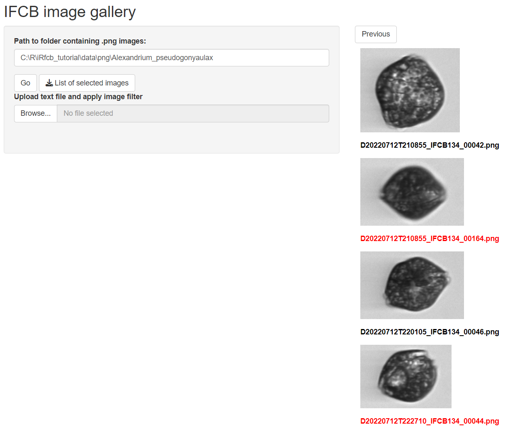

## Getting Started

#### Installation

You can install the package from GitHub using the `devtools` package:
```{r, eval=FALSE}
# install.packages("devtools")
devtools::install_github("EuropeanIFCBGroup/iRfcb",
                         dependencies = TRUE)
```
Some functions in `iRfcb` require `Python` to be installed (see in the sections below). You can download `Python` from the official website: [python.org/downloads](https://www.python.org/downloads/).

Load the `iRfcb` library:
```{r}
library(iRfcb)
```

#### Download Sample Data

To get started, download sample data from the [SMHI IFCB Plankton image reference library](https://doi.org/10.17044/scilifelab.25883455) (Torstensson et al. 2024) with the following function:
```{r}
# Define data directory
data_dir <- "data"

# Download and extract test data in the data folder
ifcb_download_test_data(dest_dir = data_dir,
                        method = "auto") # You may need to specify
```

## Extract Timestamps and Volumes

#### Extract Timestamps from IFCB sample Filenames

Extract timestamps from filenames:
```{r}
# Example sample names
filenames <- c("D20230314T001205_IFCB134",
               "D20230615T123045_IFCB135")

# Convert filenames to timestamps
timestamps <- ifcb_convert_filenames(filenames)

# Print result
print(timestamps)
```

With ROI numbers:
```{r}
# Example sample names
filenames <- c("D20230314T001205_IFCB134_00023.png",
               "D20230615T123045_IFCB135")

# Convert filenames to timestamps
timestamps <- ifcb_convert_filenames(filenames)

# Print result
print(timestamps)
```

#### Get Volume Analyzed in ml

Get the volume analyzed from header/adc files:
```{r}
# Path to HDR file
hdr_file <- "data/data/2023/D20230314/D20230314T001205_IFCB134.hdr"

# Calculate volume analyzed (in ml)
volume_analyzed <- ifcb_volume_analyzed(hdr_file)

# Print result
print(volume_analyzed)
```

#### Get Runtime

Get the runtime from a header file:
```{r}
# Get runtime from HDR-file
run_time <- ifcb_get_runtime(hdr_file)

# Print result
print(run_time)
```

## Extract .PNG Images from ROI

Extract all images from a sample:
```{r}
# All ROIs in sample
ifcb_extract_pngs("data/data/2023/D20230314/D20230314T001205_IFCB134.roi")
```

Extract specific ROIs:
```{r}
# Only ROI number 2 and 5
ifcb_extract_pngs("data/data/2023/D20230314/D20230314T003836_IFCB134.roi",
                  ROInumbers = c(2, 5))
```

To extract annotated images from MATLAB files, please see [Use MATLAB Annotated Files](#use-matlab-annotated-files)
To extract classified results from MATLAB files, please see [Classified Results from MATLAB](#classified-results-from-matlab)

## PSD QC/QA

#### Particle Size Distribution

IFCB data can be quality controlled by analyzing the particle size distribution (PSD) (Hayashi et al. in prep). `iRfcb` uses the code available at [https://github.com/kudelalab/PSD](https://github.com/kudelalab/PSD). Before running the PSD quality check, ensure the necessary Python environment is set up and activated:

```{r, eval=FALSE}
# Define path to virtual environment
env_path <- "~/virtualenvs/iRfcb-test" # Or your preferred venv path

# Install python virtual environment
ifcb_py_install(envname = env_path)

# Run PSD quality control
psd <- ifcb_psd(feature_folder = "data/features/2023",
                hdr_folder = "data/data/2023",
                save_data = FALSE,
                output_file = NULL,
                plot_folder = NULL,
                use_marker = FALSE,
                start_fit = 10,
                r_sqr = 0.5,
                beads = 10 ** 12,
                bubbles = 150,
                incomplete = c(1500, 3),
                missing_cells = 0.7,
                biomass = 1000,
                bloom = 5,
                humidity = 70)
```

```{r, include=FALSE}
# Define path to virtual environment
env_path <- "~/virtualenvs/iRfcb-test" # Or your preferred venv path

# Install python virtual environment
ifcb_py_install(envname = env_path) 

# Run PSD quality control
psd <- ifcb_psd(feature_folder = "data/features/2023",
                hdr_folder = "data/data/2023",
                save_data = FALSE,
                output_file = NULL,
                plot_folder = NULL,
                use_marker = FALSE,
                start_fit = 10,
                r_sqr = 0.5,
                beads = 10 ** 12,
                bubbles = 150,
                incomplete = c(1500, 3),
                missing_cells = 0.7,
                biomass = 1000,
                bloom = 5,
                humidity = 70)
```

```{r}
# Print output from PSD
head(psd$fits)
head(psd$flags)

# Plot PSD of the first sample
plot <- ifcb_psd_plot(sample_name = psd$data$sample[1],
                      data = psd$data,
                      fits = psd$fits,
                      start_fit = 10)

# Print the plot
print(plot)
```

## Geographical QC/QA

#### Check if IFCB is Near Land

To determine if the IFCB is near land (i.e. in harbor), examine the position data in the .hdr files (or from vectors of latitudes and longitudes):
```{r}
# Read HDR data and extract GPS position (when available)
gps_data <- ifcb_read_hdr_data("data/data/",
                               gps_only = TRUE)

# Create new column with the results
gps_data$near_land <- ifcb_is_near_land(gps_data$gpsLatitude,
                                        gps_data$gpsLongitude,
                                        distance = 100, # 100 meters from shore
                                        shape = NULL) # Using the default NE 1:50m Land Polygon

# Print output
head(gps_data)
```

For more accurate determination, a detailed coastline .shp file may be required (e.g. the [EEA Coastline Polygon](https://www.eea.europa.eu/data-and-maps/data/eea-coastline-for-analysis-2/gis-data/eea-coastline-polygon)). Refer to the help pages of `ifcb_is_near_land` for further information.

#### Check which sub-basin an IFCB sample is from

To identify the specific sub-basin of the Baltic Sea (or using a custom shape-file) from which an Imaging FlowCytobot (IFCB) sample was collected, analyze the position data:
```{r}
# Define example latitude and longitude vectors
latitudes <- c(55.337, 54.729, 56.311, 57.975)
longitudes <- c(12.674, 14.643, 12.237, 10.637)

# Check in which Baltic sea basin the points are in
points_in_the_baltic <- ifcb_which_basin(latitudes, 
                                         longitudes, 
                                         shape_file = NULL)
# Print output
print(points_in_the_baltic)

# Plot the points and the basins
ifcb_which_basin(latitudes, 
                 longitudes, 
                 plot = TRUE, 
                 shape_file = NULL)
```

This function reads a pre-packaged shapefile of the Baltic Sea, Kattegat, and Skagerrak basins from the 'iRfcb' package by default, or a user-supplied shapefile if provided. The shapefiles provided in 'iRfcb' originate from [SHARK](https://sharkweb.smhi.se/hamta-data/). 

#### Check whether the positions are within the Baltic Sea or elsewhere

This check is useful if only you want to apply a classifier specifically to phytoplankton from the Baltic Sea.

```{r}
# Define example latitude and longitude vectors
latitudes <- c(55.337, 54.729, 56.311, 57.975)
longitudes <- c(12.674, 14.643, 12.237, 10.637)

# Check if the points are in the Baltic Sea Basin
points_in_the_baltic <- ifcb_is_in_basin(latitudes, longitudes)

# Print results
print(points_in_the_baltic)

# Plot the points and the basin
ifcb_is_in_basin(latitudes, longitudes, plot = TRUE)
```

This function reads a land-buffered shapefile of the Baltic Sea Basin (including Öresund) from the 'iRfcb' package by default, or a user-supplied shapefile if provided.

#### Find missing positions from RV Svea Ferrybox

This function is used by SMHI to collect and match stored ferrybox positions when they are not available in the .hdr files. An example ferrybox data file is provided in `iRfcb` with data matching D20220522T000439_IFCB134.

```{r}
# Define path where ferrybox data are located
ferrybox_folder <- "data/ferrybox_data"

# Get GPS position from ferrybox data
positions <- ifcb_get_svea_position(gps_data$timestamp, ferrybox_folder)

# Print result
head(positions)
```

## Use MATLAB Annotated Files

#### Count and Summarize Annotated Image Data

#### PNG Directory

Summarize counts of annotated images at the sample and class levels. The 'hdr_folder' can be included to add GPS positions to the sample data frame:
```{r}
# Summarise counts on sample level
png_per_sample <- ifcb_summarize_png_data(png_folder = "data/png",
                                          hdr_folder = "data/data",
                                          sum_level = "sample")

head(png_per_sample)

# Summarise counts on class level
png_per_class <- ifcb_summarize_png_data(png_folder = "data/png",
                                         sum_level = "class")

# Print output
head(png_per_class)
```

#### MATLAB Files

Count the annotations in the MATLAB files, similar to `ifcb_summarize_png_data`:
```{r}
# Summarize counts from MATLAB files
mat_count <- ifcb_count_mat_annotations(manual_folder = "data/manual",
                                        class2use_file = "data/config/class2use.mat",
                                        skip_class = "unclassified") # Or class ID

# Print output
head(mat_count)
```

#### Run Image Gallery

To visually inspect and correct annotations, run the image gallery. 
```{r, eval=FALSE}
# Run Shiny app
ifcb_run_image_gallery()
```



Individual images can be selected and a list of selected images can be downloaded as a 'correction_file'. This file can be used to correct .mat annotations below using the `ifcb_correct_annotation` function.

#### Correct .mat Files After Checking Images in the App

After reviewing images in the gallery, correct the .mat files using the 'correction file' with selected images:
```{r}
# Get class2use
class_name <- ifcb_get_mat_names("data/config/class2use.mat")
class2use <- ifcb_get_mat_variable("data/config/class2use.mat",
                                   variable_name = class_name)

# Find the class id of unclassified
unclassified_id <- which(grepl("unclassified",
                         class2use))

# Initialize the python session if not already set up
# ifcb_py_install(envname = env_path) # If not already initialized

# Correct the annotation with the output from the image gallery
ifcb_correct_annotation(manual_folder = "data/manual",
                        out_folder = "data/manual",
                        correction_file = "data/manual/correction/Alexandrium_pseudogonyaulax_selected_images.txt",
                        correct_classid = unclassified_id)
```

#### Replace Specific Class Annotations

Replace all instances of a specific class with "unclassified" (class id 1):
```{r}
# Get class2use
class_name <- ifcb_get_mat_names("data/config/class2use.mat")
class2use <- ifcb_get_mat_variable("data/config/class2use.mat",
                                   variable_name = class_name)

# Find the class id of Alexandrium_pseudogonyaulax
ap_id <- which(grepl("Alexandrium_pseudogonyaulax",
                     class2use))

# Find the class id of unclassified
unclassified_id <- which(grepl("unclassified",
                         class2use))

# Initialize the python session if not already set up
# ifcb_py_install(envname = env_path) # If not already initialized

# Move all Alexandrium_pseudogonyaulax images to unclassified
ifcb_replace_mat_values(manual_folder = "data/manual",
                        out_folder = "data/manual",
                        target_id = ap_id,
                        new_id = unclassified_id)
```

#### Extract Annotated Images

Extract annotated images, skipping the "unclassified" (class id 1) category:
```{r, echo=TRUE, results='hide'}
# Extract .png images
ifcb_extract_annotated_images(manual_folder = "data/manual",
                              class2use_file = "data/config/class2use.mat",
                              roi_folder = "data/data",
                              out_folder = "data/extracted_images",
                              skip_class = 1, # or "unclassified"
                              verbose = FALSE)
```

#### Verify Correction

Verify that the corrections have been applied:
```{r}
# Summarize new counts after correction
png_per_class <- ifcb_summarize_png_data(png_folder = "data/extracted_images",
                                         sum_level = "class")

# Print output
head(png_per_class)
```

## Prepare Annotated Images for Publication

#### PNG Directory

Prepare the PNG directory for publication as a zip-archive, similar to the files in the [SMHI IFCB Plankton image reference library](https://doi.org/10.17044/scilifelab.25883455) (Torstensson et al. 2024):
```{r}
# Create zip-archive
ifcb_zip_pngs(png_folder = "data/extracted_images",
              zip_filename = "data/zip/smhi_ifcb_skagerrak_kattegat_annotated_images_corrected.zip",
              readme_file = system.file("exdata/README-template.md", 
                                        package = "iRfcb"), # Template icluded in `iRfcb`
              email_address = "tutorial@test.com",
              version = "1.1",
              print_progress = FALSE)
```

#### MATLAB Directory

Prepare the MATLAB directory for publication as a zip-archive, similar to the files in the [SMHI IFCB Plankton image reference library](https://doi.org/10.17044/scilifelab.25883455):
```{r}
# Create zip-archive
ifcb_zip_matlab(manual_folder = "data/manual",
                features_folder = "data/features",
                class2use_file = "data/config/class2use.mat",
                zip_filename = "data/zip/smhi_ifcb_skagerrak_kattegat_matlab_files_corrected.zip",
                data_folder = "data/data",
                readme_file = system.file("exdata/README-template.md", 
                                          package = "iRfcb"), # Template icluded in `iRfcb`
                matlab_readme_file = system.file("exdata/MATLAB-template.md", 
                                                 package = "iRfcb"), # Template icluded in `iRfcb`
                email_address = "tutorial@test.com",
                version = "1.1",
                print_progress = FALSE)
```

#### Create MANIFEST.txt

Create a manifest file for the zip packages:
```{r}
# Create MANIFEST.txt of the zip folder content
ifcb_create_manifest("data/zip/")
```

## Classified Results from MATLAB

#### Extract Classified Results from a Sample

Extract classified results from a sample:

```{r}
# Extract all classified images from a sample
ifcb_extract_classified_images(sample = "D20230810T113059_IFCB134",
                               classified_folder = "data/classified",
                               roi_folder = "data/data",
                               out_folder = "data/classified_images",
                               taxa = "All", # or specify a particular taxa
                               threshold = "opt") # or specify another threshold
```

#### Read feature data

Read all feature files (.csv) from a folder:

```{r}
# Read feature files from a folder
features <- ifcb_read_features("data/features/2023/")

# Print output of first 10 columns from the first sample in the list
head(features[[1]])[,1:10]

# Read only multiblob feature files
multiblob_features <- ifcb_read_features("data/features/2023", multiblob = TRUE)

# Print output of first 10 columns from the first sample in the list
head(multiblob_features[[1]])[,1:10]
```

#### Read a Summary File

Read a summary file:

```{r}
# Read a MATLAB summary file generated by `countcells_allTBnew_user_training`
summary_data <- ifcb_read_summary("data/classified/2023/summary/summary_allTB_2023.mat",
                                  biovolume = FALSE,
                                  threshold = "opt")

# Print output
head(summary_data)
```

#### Summarize counts, biovolumes and carbon content from classified IFCB data

This function calculates aggregated biovolumes and carbon content from Imaging FlowCytobot (IFCB) samples based on feature and MATLAB classification result files, without summarizing the data in MATLAB. Biovolumes are converted to carbon according to Menden-Deuer and Lessard (2000) for individual regions of interest (ROI), where different conversion factors are applied to diatoms and non-diatom protist. If provided, it also incorporates sample volume data from HDR files to compute biovolume and carbon content per liter of sample. See details in the help pages for `ifcb_summarize_biovolumes` and `ifcb_extract_biovolumes`.

```{r}
# Summarize biovolume data using IFCB data from the specified folders
biovolume_data <- ifcb_summarize_biovolumes(feature_folder = "data/features/2023",
                                            class_folder = "data/classified",
                                            hdr_folder = "data/data/2023",
                                            micron_factor = 1/3.4,
                                            diatom_class = "Bacillariophyceae",
                                            threshold = "opt")

# Print output
head(biovolume_data)
```

## Taxonomical Data

#### Check whether a class name is a diatom

This function takes a list of taxa names, cleans them, retrieves their corresponding classification records from the World Register of Marine Species (WoRMS), and checks if they belong to the specified diatom class. The function only uses the first name (genus name) of each taxa for classification. This function can be useful for converting biovolumes to carbon according to Menden-Deuer and Lessard (2000). See `iRfcb:::vol2C_nondiatom` and `iRfcb:::vol2C_lgdiatom` for carbon calculations (not included in NAMESPACE).

```{r}
# Read class2use file
class2use <- ifcb_get_mat_variable("data/config/class2use.mat")

# Create a dataframe with class name and result from `ifcb_is_diatom`
class_list <- data.frame(class2use,
                         is_diatom = ifcb_is_diatom(class2use))

# Print rows 10-15 of result
class_list[10:15,]
```
The default class for diatoms is defined as Bacillariophyceae, but may be adjusted using the `diatom_class` argument.

#### Find trophic type of plankton taxa

This function takes a list of taxa names and matches them with the `SMHI Trophic Type` list used in [SHARK](https://sharkweb.smhi.se/hamta-data/).

```{r}
# Example taxa names
taxa_list <- c("Acanthoceras zachariasii",
               "Nodularia spumigena",
               "Acanthoica quattrospina",
               "Noctiluca",
               "Gymnodiniales")

# Get trophic type for taxa
trophic_type <- ifcb_get_trophic_type(taxa_list)

# Print result
print(trophic_type)
```

## SHARK export

This function is used by SMHI to map IFCB data into the [SHARK](https://sharkweb.smhi.se/hamta-data/) standard data delivery format.

```{r}
# Load column names stored from `iRfcb`
shark_colnames <- ifcb_get_shark_colnames()

# Print column names
print(shark_colnames)
```

This concludes the tutorial for the `iRfcb` package. For more detailed information, refer to the package documentation. Happy analyzing!

```{r, include=FALSE}
# Clean up
unlink(data_dir, recursive = TRUE)
unlink(env_path, recursive = TRUE)
```

## Citation

```{r, echo=FALSE}
# Print citation
citation("iRfcb")
```

## References
- Hayashi, K., Walton, J., Lie, A., Smith, J. and Kudela M. Using particle size distribution (PSD) to automate imaging flow cytobot (IFCB) data quality in coastal California, USA. In prep.
- Menden-Deuer Susanne, Lessard Evelyn J., (2000), Carbon to volume relationships for dinoflagellates, diatoms, and other protist plankton, Limnology and Oceanography, 3, doi: 10.4319/lo.2000.45.3.0569.
- Sosik, H. M. and Olson, R. J. (2007) Automated taxonomic classification of phytoplankton sampled with imaging-in-flow cytometry. Limnol. Oceanogr: Methods 5, 204–216.
- Torstensson, A., Skjevik, A-T., Mohlin, M., Karlberg, M. and Karlson, B. (2024). SMHI IFCB plankton image reference library. SciLifeLab. Dataset. https://doi.org/10.17044/scilifelab.25883455.v3
